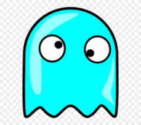

# notpackman

Basic python game, using pacman images.
This project is part of the Software Engineering course from Hyperion.

## Getting started

Make sure the program and images are all saved in the same directory before calling the program. Use the python command followed by the name of the program (**game.py**) to start it. Follwoing this a box with the game will show up and you start playing immediately.

## Game rules

Your character is pacman, which can be controled to go up, down, left and right: 

Your goal is to reach the prize:

And you need to avoid the ghosts:

# Finishing the game

If you hit a ghost the game will end and you lose. If you hit the prize the game ends and you win! 😄
